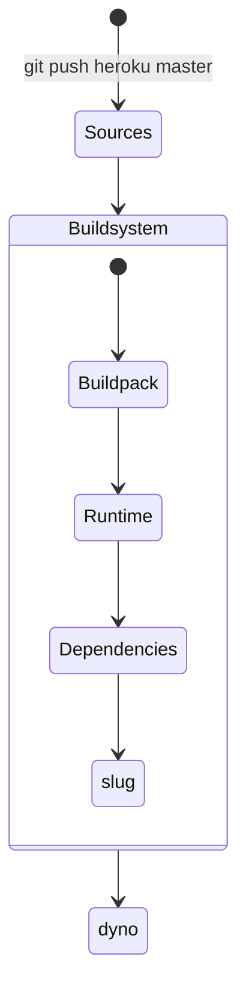

# Hinweise zum Programmierbeispiel

<!--
  Copyright (C) 2020 - present Juergen Zimmermann, Hochschule Karlsruhe

  This program is free software: you can redistribute it and/or modify
  it under the terms of the GNU General Public License as published by
  the Free Software Foundation, either version 3 of the License, or
  (at your option) any later version.

  This program is distributed in the hope that it will be useful,
  but WITHOUT ANY WARRANTY; without even the implied warranty of
  MERCHANTABILITY or FITNESS FOR A PARTICULAR PURPOSE.  See the
  GNU General Public License for more details.

  You should have received a copy of the GNU General Public License
  along with this program.  If not, see <http://www.gnu.org/licenses/>.
-->

[Juergen Zimmermann](mailto:Juergen.Zimmermann@HS-Karlsruhe.de)

> Diese Datei ist in Markdown geschrieben und kann mit `<Strg><Shift>v` in
> Visual Studio Code leicht gelesen werden. Dazu wird die Extension
> _Markdown Preview Mermaid Support_ empfohlen, um UML-Diagramme in der Syntax
> von _Mermaid_ (wie bei PlantUML) visualisieren zu können.
>
> Näheres zu Markdown gibt es z.B. bei [Markdown Guide](https://www.markdownguide.org/)
>
> Nur in den ersten beiden Vorlesungswochen kann es Unterstützung bei
> Installationsproblemen geben.

## Inhalt

- [Download- und ggf. Upload-Geschwindigkeit](#download--und-ggf.-Upload-Geschwindigkeit)
- [Vorbereitung der Installation](#vorbereitung-der-Installation)
- [Eigener Namespace in Kubernetes](#eigener-Namespace-in-Kubernetes)
- [MongoDB und Mailserver](#mongoDB-und-Mailserver)
  - [Skaffold für MongoDB und Mailserver](#skaffold-für-MongoDB-und-Mailserver)
  - [Installation mit Kustomize (ohne Skaffold) für MongoDB und Mailserver](#installation-mit-Kustomize-(ohne-Skaffold)-für-MongoDB-und-Mailserver)
  - [Deinstallieren mit Kustomize (ohne Skaffold) für MongoDB und Mailserver](#Deinstallieren-mit-Kustomize-(ohne-Skaffold)-für-MongoDB-und-Mailserver)
- [Administration des Kubernetes-Clusters](#Administration-des-Kubernetes-Clusters)
- [Node Best Practices](#node-Best-Practices)
- [Starten des Appservers (mit Node und Express)](#starten-des-Appservers-(mit-Node-und-Express))
  - [Entwicklung mit nodemon und ts-node in einer Powershell](#Entwicklung-mit-nodemon-und-ts-node-in-einer-Powershell)
  - [REST Client für eine REST- und eine GraphQL-Schnittstelle](#rEST-Client-für-eine-REST--und-eine-GraphQL-Schnittstelle)
  - [Playground für eine GraphQL-Schnittstelle](#playground-für-eine-GraphQL-Schnittstelle)
    - [Schema Introspection](#schema-Introspection)
    - [Playground bei Heroku](#playground-bei-Heroku)
- [Tests aufrufen](#tests-aufrufen)
- [Docker-Image für Kubernetes](#docker-Image-für-Kubernetes)
- [Deployment in Kubernetes](#deployment-in-Kubernetes)
  - [MongoDB und Mailserver als Voraussetzung](#mongoDB-und-Mailserver-als-Voraussetzung)
  - [Deployment mit kubectl und Kustomize](#deployment-mit-kubectl-und-Kustomize)
  - [Continuous Deployment mit Skaffold](#continuous-Deployment-mit-Skaffold)
- [Codeanalyse durch ESLint und SonarQube](#codeanalyse-durch-ESLint-und-SonarQube)
- [Sicherheitsanalyse durch snyk](#sicherheitsanalyse-durch-snyk)
- [AsciiDoctor und PlantUML](#asciiDoctor-und-PlantUML)
  - [Preview von PlantUML-Dateien](#preview-von-PlantUML-Dateien)
  - [Einstellungen für Preview von AsciiDoctor-Dateien](#einstellungen-für-Preview-von-AsciiDoctor-Dateien)
  - [Preview von AsciiDoctor-Dateien](#preview-von-AsciiDoctor-Dateien)
  - [Dokumentation im Format HTML](#dokumentation-im-Format-HTML)
- [Continuous Integration mit Jenkins](#continuous-Integration-mit-Jenkins)
  - [Aufruf mit Webbrowser](#aufruf-mit-Webbrowser)
  - [Bash zur evtl. Fehlersuche im laufenden Jenkins-Container](#bash-zur-evtl.-Fehlersuche-im-laufenden-Jenkins-Container)
  - [Evtl. Installation in Kubernetes](#evtl.-Installation-in-Kubernetes)
- [Evtl. Übersetzung durch den TypeScript-Compiler in einer Powershell](#evtl.-Übersetzung-durch-den-TypeScript-Compiler-in-einer-Powershell)
- [Monitoring durch clinic](#monitoring-durch-clinic)
- [Empfohlene Entwicklungsumgebung](#empfohlene-Entwicklungsumgebung)
  - [Visual Studio Code oder WebStorm](#visual-Studio-Code-oder-WebStorm)
- [Atlas](#atlas)
  - [Atlas von MongoDB](#atlas-von-MongoDB)
  - [Registrierung bei Atlas](#registrierung-bei-Atlas)
  - [Einloggen](#einloggen)
  - [Projekt erstellen](#projekt-erstellen)
  - [Cluster erstellen](#cluster-erstellen)
  - [DB-Benutzer erstellen](#dB-Benutzer-erstellen)
  - [Zulässige IP-Adressen für die DB-Clients](#zulässige-IP-Adressen-für-die-DB-Clients)
  - [URL für künftige DB-Verbindungen](#URL-für-künftige-DB-Verbindungen)
  - [Ausloggen bei Atlas](#ausloggen-bei-Atlas)
  - [Datenbank acme erstellen](#datenbank-acme-erstellen)
  - [Compass (oder das Plugin MongoDB for VS Code) für Atlas](#compass-(oder-das-Plugin-MongoDB-for-VS-Code)-für-Atlas)
  - [Webbrowser statt Compass](#webbrowser-statt-Compass)
- [Heroku](#heroku)
  - [Heroku von Salesforce](#heroku-von-Salesforce)
  - [dyno, slug und buildpack](#dyno,-slug-und-buildpack)
  - [Registrierung bei Heroku](#registrierung-bei-Heroku)
  - [Einmalig: Git-Repository erstellen](#einmalig:-Git-Repository-erstellen)
  - [Einloggen und Token erstellen mit der Heroku CLI](#einloggen-und-Token-erstellen-mit-der-Heroku-CLI)
  - [Leere Anwendung für Heroku erstellen](#leere-Anwendung-für-Heroku-erstellen)
  - [Umgebungsvariable für Heroku](#umgebungsvariable-für-Heroku)
  - [Deployment für Heroku](#deployment-für-Heroku)
  - [Status-Informationen zu Heroku](#status-Informationen-zu-Heroku)
  - [Verfügbarkeit der eigenen Heroku-Anwendung](#verfügbarkeit-der-eigenen-Heroku-Anwendung)
  - [Heroku-Console](#heroku-Console)
  - [Dashboard für die Verwaltung der eigenen Heroku-Anwendung(en)](#dashboard-für-die-Verwaltung-der-eigenen-Heroku-Anwendung(en))
  - [Sonstige Heroku-Kommandos](#sonstige-Heroku-Kommandos)
- [Debugging mit Visual Studio Code](#debugging-mit-VS-Code)
- [Empfohlene Code-Konventionen](#empfohlene-Code-Konventionen)
  - [JSON5.stringify() statt JSON.stringify()](#JSON5.stringify()-statt-JSON.stringify())

---

## Download- und ggf. Upload Geschwindigkeit

In einem Webbrowser kann man z.B. mit der URL `https://speed.cloudflare.com` die
Download- und die Upload-Geschwindigkeit testen.

Alternativ kann man durch das Kommando `fast` in einer Powershell die aktuelle
Download-Geschwindigkeit ermitteln.

Mit der zusätzlichen Option `--upload` kann zusätzlich die aktuelle
Upload-Geschwindigkeit ermittelt werden.

---

## Vorbereitung der Installation

- Das Beispiel _nicht_ in einem Pfad mit _Leerzeichen_ installieren.
  Viele Javascript-Bibliotheken werden unter Linux entwickelt und dort benutzt
  man keine Leerzeichen in Pfaden. Ebenso würde ich das Beispiel nicht auf dem
  _Desktop_ auspacken bzw. installieren.

- Bei [GitHub](https://github.com) registrieren, falls man dort noch nicht
  registriert ist.

---

## Eigener Namespace in Kubernetes

Ein neuer Namespace in Kubernetes, z.B. `acme`, wird durch folgendes Kommando
angelegt:

```PowerShell
    kubectl create namespace acme
```

---

## MongoDB und Mailserver

### Skaffold für MongoDB und Mailserver

Zunächst müssen _MongoDB_ und der _Mailserver_ als (Backend-) Server gestartet
werden, was mit _Skaffold_ gemacht werden kann. Wenn die Umgebungsvariable
`SKAFFOLD_PROFILE` auf den Wert `dev` gesetzt ist, dann wird das Profile `dev`
verwendet, welches das Kustomize-Overlay `dev` aufruft. Das Deployment kann
auf einem Notebook mehrere Minuten dauern.

```PowerShell
    cd backend
    skaffold dev --port-forward
```

Das Deployment wird mit dem Unterkommando `delete` wieder entfernt. Dabei muss
man manuell das _PersistentVolumeClaim_ mit dem Namen `data-volume-mongodb-0`
löschen, das durch das _StatefulSet_ `mongodb` implizit erstellt wurde.

```PowerShell
    skaffold delete
```

### Installation mit Kustomize (ohne Skaffold) für MongoDB und Mailserver

Die beiden Server können auch direkt mit _Kustomize_ gestartet werden:

```PowerShell
    cd backend\dev
    kustomize build | kubectl apply -f -
```

Falls dann Port-Forwarding benötigt wird, so muss dieses für jeden Server in
jeweils einer PowerShell eingerichtet werden:

```PowerShell
    npm run port-forward mongodb
    npm run port-forward mailserver
```

### Deinstallieren mit Kustomize (ohne Skaffold) für MongoDB und Mailserver

Um MongoDB und den Mailserver zu deinstallieren, wird wiederum `kubectl` mit
_Kustomize_ verwendet:

```PowerShell
    cd backend\dev
    kustomize build | kubectl delete -f -
```

Anschließend muss man noch manuell das _PersistentVolumeClaim_ mit dem Namen
`data-volume-mongodb-0` löschen, das durch das _StatefulSet_ `mongodb` implizit
erstellt wurde.

---

## Administration des Kubernetes-Clusters

Zur Administration des Kubernetes-Clusters ist für Entwickler*innen m.E. _Lens_
von Mirantis oder _Octant_ von VMware Tanzu oder _Kui_ von IBM gut geeignet.

---

## Node Best Practices

Sehr empfehlenswert ist https://github.com/goldbergyoni/nodebestpractices

---

## Starten des Appservers (mit Node und Express)

### Entwicklung mit nodemon und ts-node in einer Powershell

Durch _nodemon_ (= Node Monitor) wird der Appserver so gestartet, dass er z.B.
JavaScript-Dateien im laufenden Betrieb nachlädt, wenn sie später aktualisiert
werden. Zusätzlich wird _ts-node_ verwendet, damit geänderte TypeScript-Dateien
sofort in JavaScript-Dateien übersetzt werden. Eine explizite Übersetzung der
TypeScript-Dateien (s.o.) ist also _nicht_ notwendig!

Beim Starten des Appservers wird mit _mongoose_ auf _MongoDB_ zugegriffen.
Der Benutzername und das Passwort sind in der Datei `src\shared\config\db.ts`
(Zeile 40) auf `admin` und `p` voreingestellt.

Für sowohl MongoDB als auch den Mailserver muss _Port-Forwarding_ (s.o.)
aktiviert sein. Außerdem müssen in `.env` die Umgebungsvariablen `DB_HOST` und
`MAIL_HOST` auskommentiert sein, damit jeweils der Defaultwert `localhost`
verwendet wird. Durch die Umgebungsvariable `DB_POPULATE` und
`DB_POPULATE_FILES` wird festgelegt, ob die (Test-) DB `acme` neu geladen wird
und ob dabei auch Binärdateien für z.B. Bilder oder Videos neu geladen werden.
Wenn man Binärdateien abspeichern möchte, dann benötigt man in der DB `acme` die
beiden Collections `fs.files` und `fs.chunks`, die man z.B. mit _MongoDB
Compass_ innerhalb von `acme` neu anlegen kann.

Wenn man MongoDB mit _Atlas_ (s.u.) statt der lokalen Kubernetes- bzw.
Docker-Installation benutzen möchte, muss man in der Datei `.env` die
Konfigurationsdaten für Atlas eintragen und die jeweiligen Kommentare entfernen.
Es ist empfehlenswert, zuerst das Beispiel mit einer lokalen
MongoDB-Installation zum Laufen zu bringen, um die Fehlerquellen zu reduzieren.

Mit dem nachfolgenden Kommando startet man den Appserver mit _nodemon_ und
_ts-node_, der eine REST-Schnittstelle und eine GraphQL-Schnittstelle hat:

```PowerShell
    npm run start:dev
```

### REST Client für eine REST- und eine GraphQL-Schnittstelle

Im Unterverzeichnis `restclient` befinden sich in den Unterverzeichnissen `rest`
und `graphql` mehrere Dateien mit der Extension `.rest` oder `.http`.
In diesen Dateien sind Interaktionsmöglichkeiten für die REST- und die
GraphQL-Schnittstelle.

Wenn man eine dieser Dateien in VS Code öffnet, dann sieht man bei jedem
Beispiel bzw. Abschnitt, der mit `###` beginnt, eine künstliche Zeile mit
_Send Request_ (keine Zeilennummer!). Auf _Send Request_ kann man klicken und
der Request wird ausgeführt, wozu natürlich der Server erfolgreich gestartet
sein sollte.

Für den REST-Client benötigt man unterschiedliche Umgebungen (_Environment_) je
nachdem, ob der Server lokal oder in einem (lokalen) Kubernetes-Cluster oder in
der Heroku-Cloud läuft. Verschiedene Umgebungen können prinzipiell die gleichen
Eigenschaften, aber mit verschiedenen Werten haben. Beispielsweise lautet die
URL für die REST-Schnittstelle beim lokalen Server `https://localhost:3000/...`
aber im Kubernetes-Cluster `http://localhost:3000/...`. Dazu kann man über den
Menüpunkt _File_ und die beiden Unterpunkte _Einstellungen_ und nochmals
_Einstellungen_ die Einstellungen für VS Code bearbeiten. Nun klickt man auf
das Icon rechts oben ("Einstellungen öffnen"), um direkt die Datei
`settings.json` zu bearbeiten.

In der Datei `settings.json` kann man dann am Dateiende beispielsweise die
Umgebungen `local`, `kubernetes` und `heroku` einrichten, bei denen man die
Variablen `restUrl`, `loginUrl` und `graphQlUrl` definiert. Dabei muss man
darauf achten, dass die JSON-Datei syntaktisch korrekt ist und z.B. Kommata
und Anführungszeichen korrekt sind.

```JSON
    "rest-client.environmentVariables": {
      "local": {
        "restUrl": "https://localhost:3000/api/buecher",
        "loginUrl": "https://localhost:3000/api/login",
        "graphQlUrl": "https://localhost:3000/graphql"
      },
      "kubernetes": {
        "restUrl": "http://localhost:3000/api/buecher",
        "loginUrl": "http://localhost:3000/api/login",
        "graphQlUrl": "http://localhost:3000/graphql"
      },
      "heroku": {
        "restUrl": "https://gener-iert-12345.herokuapp.com/api/buecher",
        "loginUrl": "https://gener-iert-12345.herokuapp.com/api/login",
        "graphQlUrl": "https://gener-iert-12345.herokuapp.com/graphql"
      }
    }
```

Wenn man von nun an eine `.rest`-Datei öffnet, dann sieht man rechts unten in
der Statusleiste die aktuelle Umgebung. Sobald man rechts unten auf den Namen
der aktuellen Umgebung (oder _No Environment_) klickt, erscheinen die möglichen
Umgebungen in der Auswahl am oberen Fensterrand.

Im Dateisystem von Windows findet man die Datei `settings.json` im Verzeichnis
`$env:APPDATA\Code\User`. Im Windows Explorer kann man dazu in der Pfadleiste
einfach `%APPDATA%\Code\User` eingeben.

### Playground für eine GraphQL-Schnittstelle

Falls die Umgebungsvariable `NODE_ENV` _nicht_ auf `production` gesetzt ist,
stellt der _Apollo-Server_ die URI für die GraphQL-Schnittstelle auch als
_Playground_ zur Verfügung. Die URI kann dann in einem Webbrowser aufgerufen
werden, so dass man Autovervollständigen beim Absetzen von _Queries_ und
_Mutations_ hat.

Die URL für GraphQL lautet im vorliegenden Beispiel
`https://localhost:3000/graphql`. Beispielhafte _Queries_ und _Mutations_ für
GraphQL gibt es in den Dateien `restclient\graphql\buecher.query.http` und
`restclient\graphql\buecher.mutation.http`.

#### Schema Introspection

Schema Introspection ist ein Feature von GraphQL
http://spec.graphql.org/June2018/#sec-Introspection, damit ein GraphQL-Client
durch eine GraphQL-Query das Schema abgefragt werden kann, d.h. welche Queries
und Mutations mit welchen Typ-Definitionen es gibt.

Defaultmäßig ist im Playground _Schema Introspection_ aktiviert und der
Webbrowser sendet alle 2 Sekunden GraphQL-Queries - also POST-Requests -, um
abzufragen, ob sich das GraphQL-Schema geändert hat.

Solange der Webbrowser geöffnet ist, sieht man deshalb alle 2 Sekunden in der
Konsole des Servers einen neuen zusätzlichen Log-Eintrag wie z.B.

```text
POST /graphql 200 5.766 ms - -
```

Man kann das _Schema Polling_ wahlweise ganz abschalten oder das Intervall
erhöhen, indem man rechts oben auf das Icon für _Settings_ klickt und die
Property `schema.polling.enable` auf `true` setzt oder die Property
`schema.polling.interval` auf einen anderen Wert als `2000` setzt. Die
Properties sind auf der Webseite
https://github.com/prisma-labs/graphql-playground#settings beschrieben.

#### Playground bei Heroku

Wenn man den Playground bei Heroku (s.u.) mit z.B.
`https://gener-iert-12345.herokuapp.com/graphql` verwenden möchte, dann muss man
bei Heroku die Umgebungsvariable `NODE_ENV` auf `development` setzen. Dadurch
werden aber bei Deployment die _devDependencies_ _NICHT_ entfernt, was zu einem
deutlich größeren Softwarepaket bei Deployment führt.

---

## Tests aufrufen

Folgende Voraussetzungen müssen erfüllt sein:

- Der MongoDB-Server (lokal oder bei Atlas) und der Mailserver müssen gestartet
sein.
- Port-Forwarding muss für die lokal laufenden Server aktiviert sein.
- Der Appserver darf _nicht gestartet_ sein.

Dazu sind folgende Vorkehrungen notwendig:

- In `helmfile.yaml` muss beim Release `microservice` in der Zeile
`#installed: false` das Kommentarzeichen entfernt sein.
- In `.env` müssen die Umgebungsvariable `DB_HOST` und `MAIL_HOST`
auskommentiert sein, damit jeweils der Defaultwert `localhost` verwendet wird.

Nun kann man die Tests folgendermaßen in einer Powershell aufrufen:

```PowerShell
    npm t
```

---

## Docker-Image für Kubernetes

Mittels der Datei `Dockerfile` kann man ein Docker Image erstellen. Das
resultierende Image basiert auf einem _distroless_ Image für Node und enthält
_keine_ Shell. Ob das `Dockerfile` gemäß _Best Practices_ erstellt wurde, kann
man in einer PowerShell mit folgendem Kommando überprüfen:

```PowerShell
    Get-Content Dockerfile | docker run --rm --interactive hadolint/hadolint:2.1.0
```

Um das Image für Kubernetes korrekt zu bauen, müssen in `.env` die Rechnernamen
für MongoDB und den Mailserver gesetzt werden, damit nicht der Defaultwert
localhost, sondern die Kubernetes-internen Rechnernamen verwendet werden.
Außerdem muss in `.env` noch der Linux-Pfad für das Logging gesetzt werden.

Durch das Skript `docker-build.ts` wird mit Hilfe der Datei
`Dockerfile` das Docker-Image `juergenzimmermann/buch:1.0.0` gebaut:

```PowerShell
    npm run docker-build
```

---

## Deployment in Kubernetes

### MongoDB und Mailserver als Voraussetzung

Voraussetzung für das Deployment des Microservice ist, dass der MongoDB-Server
und Mailserver erfolgreich gestartet sind (s.o.).

### Deployment mit kubectl und Kustomize

Im Verzeichnis `kubernetes\dev` ist eine Konfiguration für die Entwicklung
des Appservers. Wenn das Docker-Image erstellt ist (s.o.), kann das Deployment
in Kubernetes folgendermaßen durchgeführt werden, was man z.B. mit _Lens_ ode
 _Octant_ inspizieren kann. Dabei wird die Logdatei im internen Verzeichnis
`/var/log/node` angelegt, welches durch _Mounting_ dem Windows-Verzeichnis
`C:\Zimmermann\volumes\buch` entspricht und mit _Schreibberechtigung_ existieren
muss.

```PowerShell
    cd kubernetes\dev
    kustomize build | kubectl apply -f -
```

Das Deployment kann durch `kubectl` wieder aus Kubernetes entfernt werden:

```PowerShell
    kustomize build | kubectl delete -f -
```

### Continuous Deployment mit Skaffold

Um im Rahmen von _Continuous Deployment_ das Image mit dem Tag `1.0.0` zu bauen
und in Kubernetes zu deployen, muss die Umgebungsvariable `TAG` auf den Wert
`1.0.0` gesetzt werden. Weiterhin gibt es in Skaffold die Möglichkeit,
_Profile_ zu definieren, um z.B. verschiedene Overlays in Kustomize zu
verwenden. Dazu ist in skaffold.yaml beispielsweise konfiguriert, dass die
Umgebungsvariable `SKAFFOLD_PROFILE` auf `dev` gesetzt sein muss, um das
Kustomize-Overlay `dev` zu verwenden.

Continuous Deployment mit Beobachtung von Code-Änderungen wird mit Skaffold
folgendermaßen durchgeführt und kann mit `<Strg>C` abgebrochen bzw.
zurückgerollt werden. Die Option `--port-forward` bewirkt dabei, dass das
Port-Forwarding, das in `skaffold.yaml` konfiguriert ist, auch ausgeführt wird.

```PowerShell
    $env:TAG = '1.0.0'
    skaffold dev --port-forward
```

---

## Codeanalyse durch ESLint und SonarQube

_ESLint_ wird durch folgendes npm-Skript ausgeführt:

```PowerShell
    npm run eslint
```

Für eine statische Codeanalyse durch _SonarQube_ muss zunächst der
SonarQube-Server mit _Docker Compose_ als Docker-Container gestartet werden,
wozu die Konfigurationsdatei `sonar.yaml` verwendet wird:

```PowerShell
    docker-compose -f sonar.yaml up
```

Wenn der Server zum ersten Mal gestartet wird, ruft man in einem Webbrowser die
URL `http://localhost:9000` auf. In der Startseite muss man sich einloggen und
verwendet dazu als Loginname `admin` und ebenso als Password `admin`. Danach
wird man weitergeleitet, um das initiale Passwort zu ändern. Den Loginnamen und
das neue Passwort trägt man dann in der Datei `sonar-project.properties` im
Wurzelverzeichnis bei den Properties `sonar.login` und `sonar.password` ein.

Nachdem der Server gestartet ist, wird der SonarQube-Scanner in einer zweiten
PowerShell ebenfalls mit _Docker Swarm_ gestartet, wozu die Konfigurationsdatei
`sonar-scanner.yaml` verwendet wird:

```PowerShell
    docker-compose -f sonar-scanner.yaml up
```

Der Scan-Vorgang kann evtl. **lange** dauern.

---

## Sicherheitsanalyse durch snyk

Zunächst muss man sich bei https://app.snyk.io/account registrieren und dort
auch einen Token besorgen. Danach kann man sich folgendermaßen authentifizieren
und das Projekt auf Sicherheitslücken überprüfen

```PowerShell
    synk auth <MEIN_TOKEN>
    snyk test
```

## AsciiDoctor und PlantUML

Mit AsciiDoctor und PlantUML ist die Dokumentation geschrieben.

### Preview von PlantUML-Dateien

Durch das Tastaturkürzel `<Alt>d`. Dazu ist eine Internet-Verbindung notwendig.
Beispiele für PlantUML und AsciiDoctor sind im Unterverzeichnis `doc`.

### Einstellungen für Preview von AsciiDoctor-Dateien

Zunächst müssen einmalig die Einstellungen (_Settings_) von VS Code geändert
werden. Dazu geht man über zum Menüpunkt _Datei > Einstellungen > Einstellungen_
und gibt im Suchfeld `asciidoc.use_kroki` ein. Nun setzt man den Haken bei
_Enable kroki integration to generate diagrams_.

Wenn man zum ersten Mal eine `.adoc`-Datei im Editor öffnet, muss man noch
die Verbindung zum PlantUML-Server zulassen, damit die eingebundenen
`.puml`-Dateien in `.svg`-Dateien konvertiert werden. Dazu gibt man zunächst
das `<F1>` ein und schickt im Eingabefeld das Kommando
_AsciiDoc: Change Preview Security Settings_ durch `<Enter>` ab.
Danach wählt man den Unterpunkt _Allow insecure content_ aus.

### Preview von AsciiDoctor-Dateien

Durch das Tastaturkürzel `<Strg><Shift>v`. Dazu ist eine Internet-Verbindung
notwendig.

### Dokumentation im Format HTML

Die Dokumentation im Format HTML wird in einer Powershell folgendermaßen
im Verzeichnis `doc\html` erstellt:

```PowerShell
    npm run asciidoc
```

## Continuous Integration mit Jenkins

Jenkins wird nicht in Kubernetes, sondern direkt mit _Docker Compose_ genutzt.
Dadurch muss Jenkins nicht immer laufen und kann bei Bedarf gestartet und wieder
heruntergefahren werden.

```PowerShell
    docker-compose -f jenkins.yaml up
```

Mit Docker Dashboad kann man die beiden Container für Jenkins selbst und für die
Bereitstellung von Zertifikaten herunterfahren.

### Aufruf mit Webbrowser

Mit der URL https://localhost:9090 kann man von einem Webbrowser auf das
Jenkins-Image zugreifen. Der Benutzername ist `admin` und das Passwort
`Software Engineering WI.`.

### Bash zur evtl. Fehlersuche im laufenden Jenkins-Container

```PowerShell
    docker-compose -f jenkins.yaml exec jenkins bash
```

### Evtl. Installation in Kubernetes

Siehe https://www.jenkins.io/doc/book/installing/kubernetes

## Evtl. Übersetzung durch den TypeScript-Compiler in einer Powershell

```PowerShell
    npm run tsc
```

## Monitoring durch clinic

Für Monitoring kann man z.B. `clinic` nutzen, indem man zunächst dem TypeScript-Compiler
durch `npm run tsc` aufruft und danach `npm run clinic`.

## Empfohlene Entwicklungsumgebung

### Visual Studio Code oder WebStorm

[Visual Studio Code](https://code.visualstudio.com/Download) kann man
kostenfrei herunterladen.

> Tipps:
>
> - `<Strg>kc` : Markierte Zeilen werden auskommentiert (wie bei Visual Studio)
> - `<Strg>ku` : Bei markierten Zeilen wird der Kommentar entfernt
> - `<F1>`: Die Kommandopalette erscheint
> - `<Strg><Shift>v`: Vorschau für MarkDown und AsciiDoctor
> - `<Alt>d`: Vorschau für PlantUml

Für WebStorm gibt es bei [JetBrains](http://jetbrains.com/student) auf
Initiative von Jürgen Zimmermann eine Studenten-Lizenz, die für 1 Jahr gültig
ist.

## Atlas

### Atlas von MongoDB

Atlas ist vom Unternehmen [MongoDB, Inc.](https://www.mongodb.com/cloud/atlas)
und bietet _Database as a Service_. Als zugrundeliegende Infrastruktur kann
zwischen _AWS_ (Amazon Web Services), _Microsoft Azure_ und
_GCP_ (= Google Cloud Platform) gewählt werden.

Atlas ist ursprünglich von Unternehmen _mLab_, das 2018 von MongoDB, Inc.
übernommen wurde.

### Registrierung bei Atlas

Zu Beginn muss man sich unter https://cloud.mongodb.com registrieren und
füllt das Registrierungsformular mit Emailadresse (als künftiger _Username_),
Passwort und "Company Name" (als zukünftige _Organization_) aus.

### Einloggen

Bei https://cloud.mongodb.com kann man sich jetzt mit der mit der
_Emailadresse_ als _Username_ einloggen.

### Projekt erstellen

Nachdem man sich eingeloggt hat und unterhalb von _Organization_ den Menüpunkt
_Projects_ ausgewählt hat, erstellt man ein Projekt, indem der Button
_New Project_ angeklickt wird. Für das Projekt muss man einen Namen angeben.
Der Projektname ist nur für Verwaltungszwecke und hat keine Auswirkungen auf
die spätere "Connection URL" der DB.
Man kann auch weitere "Member" mit ihrer Emailadresse hinzufügen, was aber
nicht erforderlich ist.

Mit dem Button _Create Project_ wird das Projekt nun angelegt.

### Cluster erstellen

Nachdem das Projekt erstellt ist, wird ein Cluster angelegt, indem man auf den
Button _Build a Cluster_ klickt. Nun kann man durch den Button
_Create a Cluster_ unterhalb von "Shared Clusters" einen kostenlosen Cluster
anlegen.

Danach wählt man den "Provider", z.B. _aws_ (Amazon Web Services), und die
"Region", z.B. Frankfurt, aus. Durch den Button _Create Cluster_ wird der
kostenlose Cluster mit dem Namen `Cluster0` schließlich angelegt, was einige
Minuten dauern kann.

### DB-Benutzer erstellen

Jetzt wählt man das Untermenü _SECURITY > Database Access_ aus, um einen
DB-Benutzer zu erstellen. Dort klickt man auf den Button _Add New Database User.

Im Formular füllt man die beiden Felder für "Username" und "Password" aus.
Danach schickt man mit dem Button _Add User_ das Formular ab und wartet,
bis die Statusmeldung "We are deploying your changes" verschwunden ist.

### Zulässige IP-Adressen für die DB-Clients

Jetzt wählt man das Untermenü _SECURITY > Network Access_ aus, um zu
konfigurieren, welche IP-Adressen für die DB-Clients zulässig sein sollen
("Whitelist"). Dazu klickt man auf den Button _Add IP Address_.
Nun klickt man unächst den Button _Allow Access from anywhere_ und danach den
Button _Confirm_.

Das vereinfacht den Zugang von einer Cloud, wie z.B. _Heroku_ oder  _OpenShift_
sowie bei dynamischen IP-Adressen in einem öffentlichen WLAN.

### URL für künftige DB-Verbindungen

Jetzt wählt man das Untermenü _DATA STORAGE > Clusters_ aus, um die URL
für künftige DB-Verbindungen zu erhalten. Dazu klickt man zunächst auf den
Button _Connect_ und dann auf den Menüpunkt _Connect Your Application_.
Nun kann man auf den Button _Copy_ klicken und hat die URL im "Copy Buffer",
so dass man die URL mit `<Strg>v` kopieren bzw. sichern kann. Die URL sieht
im Prinzip so aus:

```text
    mongodb+srv://...:<password>@cluster0-?????.mongodb.net/test?retryWrites=true&w=majority
```

_CAVEAT_: Das eigene Passwort wird aus Sicherheitsgründen nicht angezeigt,
sondern der Platzhalter `<password>`. Diesen Platzhalter muss man natürlich
ersetzen, wenn man die URL im eigenen Appserver (als DB-Client) nutzt.

### Ausloggen bei Atlas

Rechts oben kann man sich über den Menüpunkt _Sign Out_ ausloggen.

### Datenbank acme erstellen

Um nicht die DB `test` (s.o. in der URL) im künftigen Appserver zu benutzen,
erstellt man in einer Powershell mit der Mongo CLI eine eigene DB (z.B. `acme`)
mit einer leeren Collection (z.B. `Buch`):

```text
    mongo "mongodb+srv://<<MEINE_KENNUNG>>:<<MEIN_PASSWORT_>>@cluster0-....mongodb.net/test?w=majority"
        use acme
        db.createCollection('Buch')
        exit
```

Bei einer DB-URL ist `retryWrites=true` der Default-Wert und kann deshalb
weggelassen werden.

### Compass (oder das Plugin MongoDB for VS Code) für Atlas

In Compass muss man für Atlas bei den Verbindungseinstellungen folgende Werte
in den Eingabefeldern eingeben bzw. auswählen:

| Eingabefeld        | Wert                                        |
|--------------------|---------------------------------------------|
| _Hostname_         | `cluster0-?????.mongodb.net`                |
| _Authentication_   | `Username / Password` statt `SCRAM-SHA-256` |
| _Replica Set Name_ | `Cluster0-shard-0`                          |
| _SSL_              | `System CA / Atlas Deployment`              |

### Webbrowser statt Compass

Wenn man bei https://cloud.mongodb.com eingeloggt ist und den Menüpunkt
_Clusters_ ausgewählt hat, kann man auch auf den Button _Collections_ klicken
und so die eigene(n) Collection(s) und Indexe inspizieren.

## Heroku

### Heroku von Salesforce

_Heroku_ ist eine Cloud-Plattform und funktioniert als PaaS
(= Plattform as a Service), so dass man eine Programmier- und Laufzeitumgebung
in der Cloud hat: https://www.heroku.com/platform. Heroku wird seit 2007
entwickelt und wurde 2010 vom CRM-Anbieter
[Salesforce](https://www.salesforce.com/de/products/platform/products/heroku/)
übernommen.

Mit Heroku lassen sich Anwendungen für z.B. _Node_ oder _Java_ entwickeln.
Als Datenbank kann man z.B. _PostgreSQL_ oder _MongoDB_ verwenden.
Das Deployment erfolgt auf der Basis von _Git_ (s.u.).

### dyno, slug und buildpack

Heroku-Anwendungen laufen in mehreren leichtgewichtigen _Containern_, die
_dyno_ heißen. Ein _Web dyno_ wird in der Datei `Procfile` mit dem Prozess-Typ
_web_ deklariert. Nur Web dynos können HTTP-Requests empfangen und -Responses
senden.

Nachdem die eigene Anwendung gepackt und komprimiert ist, wird sie als _slug_
bezeichnet. Ein _slug_ kann danach in einem _dyno_ ausgeführt werden.
Die maximale Größe für ein _slug_ beträgt 500 MB.

Mit Hilfe von einem _buildpack_ wird die eigene Anwendung zu einem _slug_
transformiert. Dazu benötigt Heroku diverse Skripte, die von der jeweiligen
Programmiersprache, z.B. JavaScript oder Java, abhängen. Mit diesen Skripten
wird z.B. die Fremdsoftware (_dependencies_) geladen, die man innerhalb der
eigenen Anwendung nutzt, und es wird ggf. der Compiler aufgerufen.

Wenn es im Wurzelverzeichnis eine Datei `package.json` gibt, verwendet Heroku
das _Node.js buildpack_ und ergänzt seine Umgebungsvariable `PATH` um die Pfade
für `node`, `npm` und `node_modules/.bin`.

### Registrierung bei Heroku

Zu Beginn muss man sich bei https://signup.heroku.com registrieren, indem man
das Formular ausfüllt, mit dem Button _CREATE FREE ACCOUNT_ abschickt und
abschließend den Link in der Bestätigungsemail anklickt.

### Einmalig: Git-Repository erstellen

In VS Code sind folgende Einstellungen empfehlenswert, nachdem man das
Beispielprojekt in VS Code geöffnet hat, indem man VS Code startet und über
_Datei_ und den Unterpunkt _Ordner öffnen_ das Verzeichnis mit dem
Beispielprojekt geöffnet hat. Jetzt kann man über _Datei_, den Unterpunkt
_Einstellungen_ und nochmals _Einstellungen_ im Eingabefeld `Git` eingeben.
Nun sieht man die Konfigurationsmöglichkeiten für Git und setzt die Haken bei
`Git: Enable Smart Commit` und bei `Git: Suggest Smart Commit`.

Jetzt klickt man auf das Icon _Quellcodeverwaltung_ am linken Rand und
anschließend auf den Button `Repository initialisieren`.

Man bleibt in der _Quellcodeverwaltung_ und sieht nun viele Dateien markiert mit
`U` (ncommitted). Im Eingabefeld steht der Hinweis _Nachricht_, wo man z.B.
`Initiale` Version eingibt und dann auf den Haken (Tooltipp: _Commit_) klickt.

### Einloggen und Token erstellen mit der Heroku CLI

Mit dem Tastaturkürzel `<F1>` öffnet man die Kommando*P*alette.
Dort gibt man `heroku login` ein und über das nun geöffnete Powershell-Terminal
wird der Webbrowser mit der Login-URL für Heroku gestartet, so dass man sich
dort einloggen kann, wozu man die Emailadresse und das Passwort von der
zuvor erfolgten Registrierung verwendet.

Nach dem erfolgreichen Einloggen gibt es zur Verwaltung das Verzeichnis
`C:\Users\<MEINE_KENNUNG>\AppData\Local\heroku`.

### Leere Anwendung für Heroku erstellen

In der Kommandopalette durch `<F1>` gibt man `heroku create` ein.
Die Ausgabe im Powershell-Terminal sieht dann prinzipiell folgendermaßen aus:

```text
https://gener-iert-12345.herokuapp.com/ | https://git.heroku.com/gener-iert-12345-53594.git
```

Jetzt gibt es also eine generierte Domain für die eigene Anwendung, die künftig
über z.B. https://gener-iert-12345.herokuapp.com/ erreichbar sein wird.

Die ausgegebene URL nimmt man, um in _package.json_ innerhalb von `"scripts": {`
die dortige URL `https://gener-iert-12345.herokuapp.com/` bei den Skripten
`curl:heroku` und `open:heroku` zu überschreiben.

### Umgebungsvariable für Heroku

Mit der Kommandopalette durch `<F1>` gibt man `heroku config:set` und
anschließend prinzipiell `DB_HOST=cluster0-?????.mongodb.net`, wobei die ?
gemäß der obigen Atlas-Konfiguration ersetzt werden müssen. Dabei kann man im
Powershell-Terminal die Interaktion mit Heroku verfolgen.

Das wiederholt man dann noch für die Umgebungsvariable mit den passenden
Werten für Benutzername und Passwort aus der Atlas-Konfiguration:

- DB_USER=?????
- DB_PASS=?????
- LOG_DIR=/tmp
- APOLLO_PLAYGROUND=true
- DB_POPULATE=true

### Deployment für Heroku

Für das erstmalige Deployment und nach künftigen Codeänderungen gibt man
in der Kommandopalette (durch `<F1>`) das Kommando `git push heroku master` ein.
Durch diese Push-Operation von Git wird in Heroku ein _slug_ erstellt.
Dabei wird die Anwendung gepackt und komprimiert, so dass sie einschließend in
einem _dyno_ (leichtgewichtiger Linux-Container) ablaufen kann.
Im PowerShell-Terminal kann man dabei den Ablauf mitverfolgen.



Nur die in Git versionierten Dateien werden für das Deployment verwendet,
weshalb nur die TypeScript-Dateien zu Heroku hochgeladen werden, die dann dort
zu lauffähigen JavaScript-Dateien übersetzt werden müssen. Dazu gibt es das
npm-Skript `heroku-postbuild`, das innerhalb von Heroku aufgerufen wird und
nicht manuell aufgerufen werden muss.

Wer _husky_ kennt und zusammen mit Git verwenden möchte, muss es noch
konfigurieren. Z.Zt. ist _husky_ nur in `package.json` eingetragen, weshalb
man beim Deployment einen vernachlässigbaren Fehler erhält.

Nach einem erfolgreichen Deployment sollte man (als Student/in) die
Heroku-Anwendung durch das Kommando `heroku ps:scale web=1` so skalieren, dass
sie nur _1_ Web dyno nutzt. Analog kann man durch `heroku ps:scale web=0` die
eigene Anwendung deaktieren.

Durch das Kommando `heroku buildpacks` kann man sich auflisten lassen, welche
buildpacks beim Erstellen von einem slug verwendet werden.

### Status-Informationen zu Heroku

Mit `heroku ps` kann man sich anzeigen lassen, wieviele freie "Dyno-Stunden"
man im aktuellen Monat noch hat und wieviele bereits verbraucht sind.
Persönliche Accounts verfügen monatlich über 550 freie "Dyno-Stunden":
https://devcenter.heroku.com/articles/free-dyno-hours.

### Verfügbarkeit der eigenen Heroku-Anwendung

Nach dem Deployment ist die eigene Anwendung verfügbar und kann benutzt
werden. Beispielsweise kann man in einer eigenen Powershell das Kommando
`npm run curl:heroku` aufrufen. Dabei wird mit `curl` auf die URL
`https://gener-iert-12345.herokuapp.com/buecher/00000000-0000-0000-0000-000000000001`
zugegriffen.

Alternativ kann man auch `npm run open:heroku` oder `npm run open:heroku:file`
oder `npm run open:heroku:html` aufrufen, dann wird der Response in einem
Webbrowser angezeigt.

### Heroku-Console

Mit der Kommandopalette durch `<F1>` kann man
`heroku logs --tail --app gener-iert-12345` eingeben und die Logging-Ausgaben
auf der Heroku-Console mitverfolgen, ähnlich wie bei Linux mit `tail -f`.

### Dashboard für die Verwaltung der eigenen Heroku-Anwendung(en)

Unter https://dashboard.heroku.com kann man die eigene Anwendung verwalten.

Wenn man dort die eigene Anwendung selektiert bzw. anklickt, kann man z.B. über
den Karteireiter _Settings_ eine Anwendung vom Netz nehmen, indem man den
_Maintenance Mode_ einschaltet (am Seitenende). Auch kann man dort die
Anwendung ggf. löschen.

### Sonstige Heroku-Kommandos

Mit `heroku run ...` kann man ein einzelnes Kommando als REPL
(= Read-eval-print loop) laufen lassen. So zeigt z.B. das Kommando
`heroku run --app gener-iert-12345 node --version` an, welche Node-Version für
die Heroku-Anwendung verwendet wird.
Oder mit `heroku run  --app gener-iert-12345 printenv` kann man sich die
Umgebungsvariable für die Heroku-Anwendung anzeigen lassen.

Mit `heroku addons` kann man sich zusätzlich installierte Add-ons anzeigen
lassen. Beispielsweise könnte man das Add-on _mLab MongoDB_ statt _Atlas_
verwenden.

## Debugging mit VS Code

- Das _Debug Icon_ in der _Activity Bar_ anklicken
- Den Tab _Terminal_ auswählen, dort in das Projektverzeichnis wechseln und
  dann `nodemon` als (Remote) Server starten:

```PowerShell
    cd <Projektverzeichnis>
    nodemon -V
```

`nodemon` ruft dann die JS-Datei auf, die in `package.json` bei der Property
_main_ steht, d.h. `dist\index.js`, d.h. die Übersetzung durch TypeScript muss
vorher manuell durchgeführt werden.

Nun kann man Breakpoints setzen, indem man bei einer geöffneten .ts-Datei links
von der Zeilennummer klickt. Beim Übersetzen hat nämlich der TypeScript-Compiler
Dateien für das _Source Mapping_ generiert.

Jetzt muss man nur noch links oben bei "Debugging starten" auf den linken grünen
Button klicken (siehe auch .vscode\launch.json).

_Am Ende nicht vergessen, im Terminal den Server mit `<Strg>C` zu beenden!_

[Dokumentation zum Debugging](https://code.visualstudio.com/docs/nodejs/nodejs-debugging)
oder https://www.sitepoint.com/debug-node-app-tips-tricks-tools.

## Empfohlene Code-Konventionen

In Anlehnung an die
[Guidelines von TypeScript](https://github.com/Microsoft/TypeScript/wiki/Coding-guidelines)

- "Feature Filenames", z.B. buch.service.ts
- Klassennamen und Enums mit PascalCase,
- Attribute und Funktionen mit camelCase,
- private Properties _nicht_ mit vorangestelltem **\_**,
- Interfaces _nicht_ mit vorangestelltem **I**
- _Barrel_ für häufige Imports, z.B.
  - `shared\index.ts` erstellen:

```javascript
    export * from './bar';
    export * from './foo';
```

- einfaches Importieren:

```javascript
    import { Bar, Foo } from 'shared';
```

- [...].forEach() und [...].filter() statt for-Schleife
- Arrow-Functions statt function()
- undefined verwenden, nicht: null
- Geschweifte Klammern bei if-Anweisungen
- Maximale Dateigröße: 400 Zeilen
- Maximale Funktionsgröße: 75 Zeilen

### JSON5.stringify() statt JSON.stringify()

Wenn man bei der String-Ausgabe von JSON-Objekten oder -Arrays nicht die
puristische Ausgabe mit Anführungszeichen bei den Schlüsseln haben möchte,
dann kann man `JSON5.stringify()` statt `JSON.stringify()` verwenden:

```javascript
    import JSON5 from 'json5';
    ...
    JSON5.stringify(obj);
```
